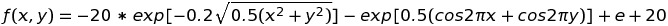
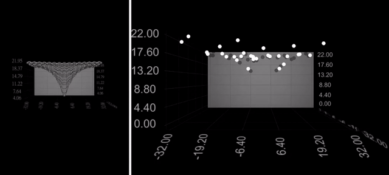
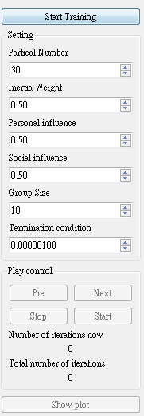

# [School Project] Particle Swarm Optimization
This program simulates the process which finding the best solution of the Ackley function with particle swarm optimization method
## Object function : Ackley function

## Configures
* The number of partical : (Dedault) 30
* Inertia weight : (Dedault) 0.5
* Personal influence : (Dedault) 0.5
* Social influence : (Dedault) 0.5
* Group size : (Dedault) 10
* Termination condition : (Dedault) 0.000001

